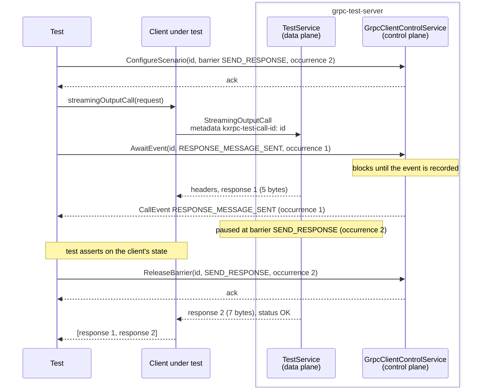
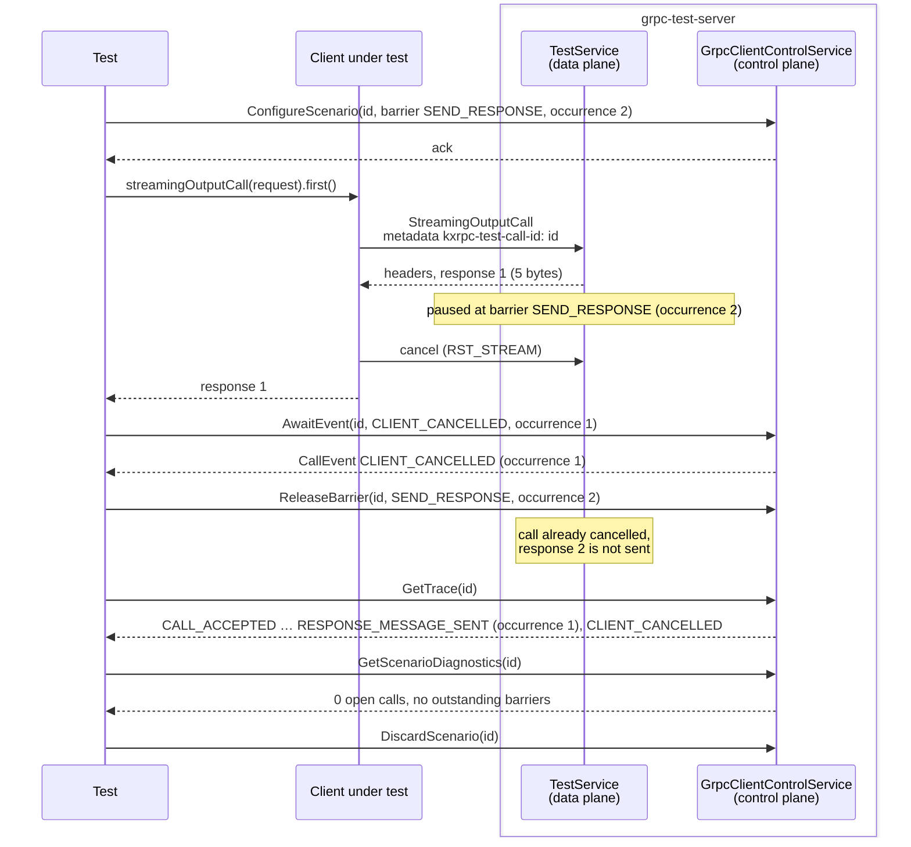

# grpc-test-server

A standalone grpc-java server that kotlinx-rpc's gRPC client tests run against. Using a plain grpc-java
server keeps the reference behaviour independent of kotlinx-rpc's own server, and lets tests control
the server side of a call deterministically: pause it at chosen points, change how it terminates,
and inspect what it observed.

The server listens on `127.0.0.1:50051` and prints this line once it accepts calls:

```
[GRPC-TEST-SERVER] Server started on 127.0.0.1:50051; control protocol v1
```

## Running

Test tasks opt in with `withGrpcClientTestServer()` (`gradle-conventions/.../util/grpc/grpcClientTestServer.kt`):

```kotlin
tasks.withType<AbstractTestTask>().configureEach {
    withGrpcClientTestServer()
}
```

The server is installed with `:tests:grpc-test-server:installDist`, started before the first such
task, shared by all of them, and stopped when the build finishes. A task fails if the server cannot
start or exits while the task runs.

To run it by hand, e.g. for a test binary started outside Gradle:

```bash
./gradlew :tests:grpc-test-server:installDist
tests/grpc-test-server/build/install/grpc-test-server/bin/grpc-test-server
```

The server's own tests: `./gradlew :tests:grpc-test-server:test`.

## Services

All protos are shared with the client tests through `tests/test-protos/src/commonMain/proto`.

Most tests use the gRPC **interop** service. gRPC's
[interoperability tests](https://github.com/grpc/grpc/blob/master/doc/interop-test-descriptions.md) define a
standard service, `grpc.testing.TestService`, and a set of test cases on top of it. Every gRPC
implementation (C++, Java, Go, Swift, ...) ships a server and a client for it, so that any client can be
checked against any server for the same behaviour. Implementing the same service here means the client
tests exercise well-known, precisely specified calls (empty, unary, server-, client-, and bidirectional
streaming with requested sizes, delays, and statuses), and the reference behaviour comes from grpc-java.

| Service                                    | Proto                                 | Purpose                                                                                                        |
|--------------------------------------------|---------------------------------------|----------------------------------------------------------------------------------------------------------------|
| `EchoService`, `GreeterService`            | `echo_grpc.proto`, `helloworld_grpc.proto` | Simple services used by the `grpc-core` tests.                                                            |
| `grpc.testing.TestService`                 | `grpc/testing/test.proto` (vendored)  | The official gRPC interop service, implemented like grpc-java's `TestServiceImpl`. `UnimplementedCall` and `UnimplementedService` return `UNIMPLEMENTED`. |
| `kxrpc.testing.MalformedResponseService`   | `kxrpc/testing/client_control.proto`  | Answers a unary or client-streaming call with zero or two responses, which a conforming server cannot produce. |
| `kxrpc.testing.GrpcClientControlService`   | `kxrpc/testing/client_control.proto`  | Called by the tests themselves to set up, drive, and inspect scenarios (see [Scenarios](#scenarios)).          |

`TestService` calls without scenario metadata behave exactly like calls to grpc-java's interop server.
`MalformedResponseService` calls always need a scenario, which selects the cardinality.

## Scenarios

### Data-plane and control-plane calls

A test sends two kinds of gRPC calls to the server, normally both to `127.0.0.1:50051`:

- **Data-plane calls** are the calls under test: the kotlinx-rpc client code being tested calls
  `TestService` or `MalformedResponseService`, for example `testService.unaryCall(request)`.
- **Control-plane calls** are calls that the test makes itself, through a separate client, to
  `GrpcClientControlService`. They prepare and observe a data-plane call; the client under test never
  sees them.

A **scenario** connects the two. It is server-side state that the test registers under an id of its
choice, the `call_id`. A data-plane call opts into the scenario by sending the ASCII request metadata
`kxrpc-test-call-id: <call_id>`. The server then handles that call as the scenario describes and
records every step of it.

### Control-plane methods

All methods of `GrpcClientControlService` take the `call_id` of the scenario they act on.

| Method                                              | What it does                                                                                                                                                             |
|-----------------------------------------------------|--------------------------------------------------------------------------------------------------------------------------------------------------------------------------|
| `ConfigureScenario`                                 | Registers a scenario and its behaviour (see below). Must be called before the data-plane call starts; each `call_id` can be configured once.                            |
| `AwaitEvent`                                        | Blocks until the server has recorded the requested event for the scenario, for example the second `RESPONSE_MESSAGE_SENT`, and returns it. Lets a test wait until the server has reached a certain point of the call. |
| `ReleaseBarrier`                                    | Lets a data-plane call continue that is paused at one of the scenario's barriers.                                                                                       |
| `GrantInboundDemand`                                | For scenarios with manual inbound demand: allows the server to read the given number of further request messages. Until then, requests stay unread, so a test can check how the client handles backpressure. |
| `GetTrace`                                          | Returns all events recorded for the scenario so far, in order.                                                                                                           |
| `GetScenarioDiagnostics`                            | Returns the number of open data-plane calls, the barriers not yet released, and the number of control-plane calls still blocked, so a test can assert that nothing leaked. |
| `StartDisposableEndpoint`, `StopDisposableEndpoint` | Starts a separate listener on a free port for the scenario's data-plane calls, and later resets all of its TCP connections, which simulates a lost connection.          |
| `DiscardScenario`                                   | Removes the scenario, fails control-plane calls still waiting on it, and stops its disposable endpoint.                                                                 |

A typical test

1. calls `ConfigureScenario`,
2. starts the data-plane call with the `kxrpc-test-call-id` metadata,
3. while the call runs, synchronizes with the server using `AwaitEvent`, `ReleaseBarrier`, and `GrantInboundDemand`,
4. afterwards checks what the server observed with `GetTrace` and `GetScenarioDiagnostics`, and
5. calls `DiscardScenario`.

### What a scenario can configure

- **Barriers.** A barrier is a point in the server's handling of the call where it pauses until the test
  calls `ReleaseBarrier`. The types are `SEND_INITIAL_HEADERS`, `SEND_RESPONSE`, `CLOSE_CALL`,
  `DELIVER_REQUEST_MESSAGE` (before passing a received request to the service), and
  `DELIVER_CLIENT_HALF_CLOSE`, each with a one-based occurrence: `SEND_RESPONSE` occurrence 2 pauses the
  call right before its second response. Barriers make races reproducible, for example cancelling a call
  exactly between two responses.
- **Metadata**: entries added to the response headers and trailers.
- **Terminal behaviour**: close the call with a given status before the headers, after the headers, after
  N responses, or instead of the service's own status.
- **Flow control**: manual inbound demand (see `GrantInboundDemand`), and pausing responses while the
  client is not ready to receive them.
- **Malformed response cardinality**: whether `MalformedResponseService` sends zero or two responses.

### Events

The server records each step of a scenario's data-plane call as a `CallEvent`: `CALL_ACCEPTED`,
`REQUEST_MESSAGE_RECEIVED`, `CLIENT_HALF_CLOSED`, `INITIAL_HEADERS_SENT`, `RESPONSE_MESSAGE_SENT`, and
finally `CALL_CLOSED` or `CLIENT_CANCELLED`; plus `RESPONSE_DELIVERY_BLOCKED`/`RESPONSE_DELIVERY_READY` for
flow control. Each event has a one-based occurrence per type, which `AwaitEvent` and barriers refer to.

### Errors

Control-plane calls for an unknown `call_id` fail with `NOT_FOUND`, invalid configurations with
`INVALID_ARGUMENT`. Waits give up after 10 seconds with `DEADLINE_EXCEEDED`, so a broken test cannot hang
the server.

## Examples

The examples use the kotlinx-rpc client. `control` is the control-plane `GrpcClientControlService`;
`testService` is the data-plane `TestService`, whose client attaches `kxrpc-test-call-id: <id>` to every
call (for example with a `GrpcClientInterceptor` that appends it to `requestHeaders`).

Both examples use this streaming request, which asks the server for two responses of 5 and 7 bytes:

```kotlin
val request = StreamingOutputCallRequest {
    responseParameters = listOf(ResponseParameters { size = 5 }, ResponseParameters { size = 7 })
}
```

### Holding a response at a barrier

Check what the client does while the server has sent the first response but not the second:

```kotlin
control.configureScenario(ConfigureScenarioRequest {
    callId = id
    barriers = listOf(Barrier { type = BarrierType.SEND_RESPONSE; occurrence = 2u })
})

val responses = async { testService.streamingOutputCall(request).toList() }

// Returns once the server has sent the first response; it is now paused before the second one.
control.awaitEvent(AwaitEventRequest { callId = id; event = EventType.RESPONSE_MESSAGE_SENT; occurrence = 1u })
// ... assert on the client's state here ...
control.releaseBarrier(ReleaseBarrierRequest { callId = id; barrier = BarrierType.SEND_RESPONSE; occurrence = 2u })

assertEquals(2, responses.await().size)
```



### Checking that a cancellation reached the server

A client that stops collecting a response stream must also cancel the call on the server. The same
barrier keeps the call open after the first response, so the cancellation cannot race with a normal
completion. The trace then shows what the server observed:

```kotlin
control.configureScenario(ConfigureScenarioRequest {
    callId = id
    barriers = listOf(Barrier { type = BarrierType.SEND_RESPONSE; occurrence = 2u })
})

// Takes the first response and stops collecting, which must cancel the call.
testService.streamingOutputCall(request).first()

// The cancellation reaches the server asynchronously, so wait for it.
control.awaitEvent(AwaitEventRequest { callId = id; event = EventType.CLIENT_CANCELLED; occurrence = 1u })
control.releaseBarrier(ReleaseBarrierRequest { callId = id; barrier = BarrierType.SEND_RESPONSE; occurrence = 2u })

val trace = control.getTrace(GetTraceRequest { callId = id })
assertEquals(EventType.CLIENT_CANCELLED, trace.events.last().type)

val diagnostics = control.getScenarioDiagnostics(GetScenarioDiagnosticsRequest { callId = id })
assertEquals(0u, diagnostics.activeCallCount)
assertEquals(emptyList(), diagnostics.outstandingBarriers)

control.discardScenario(DiscardScenarioRequest { callId = id })
```



## Code map

| File                             | Role                                                                          |
|----------------------------------|-------------------------------------------------------------------------------|
| `TestServer.kt`                  | Entry point; wires the services on port 50051.                                |
| `CallScenarioRegistry.kt`        | Scenario state: configuration, trace, barriers, inbound demand, diagnostics.   |
| `ScenarioInterceptor.kt`         | Applies a scenario to calls carrying `kxrpc-test-call-id` and records their lifecycle. |
| `InteropTestService.kt`          | The interop `TestService`; paces streaming responses.                         |
| `ManualInboundDemand.kt`         | Manual inbound demand: requests are read only as the test grants demand.      |
| `ResponseReadinessGate.kt`       | Response readiness: holds responses back while the client is not ready.       |
| `MalformedResponseTestService.kt`| Raw handlers that send zero or two responses.                                 |
| `GrpcClientControlService.kt`    | The control-plane RPCs.                                                       |
| `DisposableEndpointManager.kt`, `ResettingTcpProxy.kt` | Per-scenario listeners whose connections can be reset.  |
